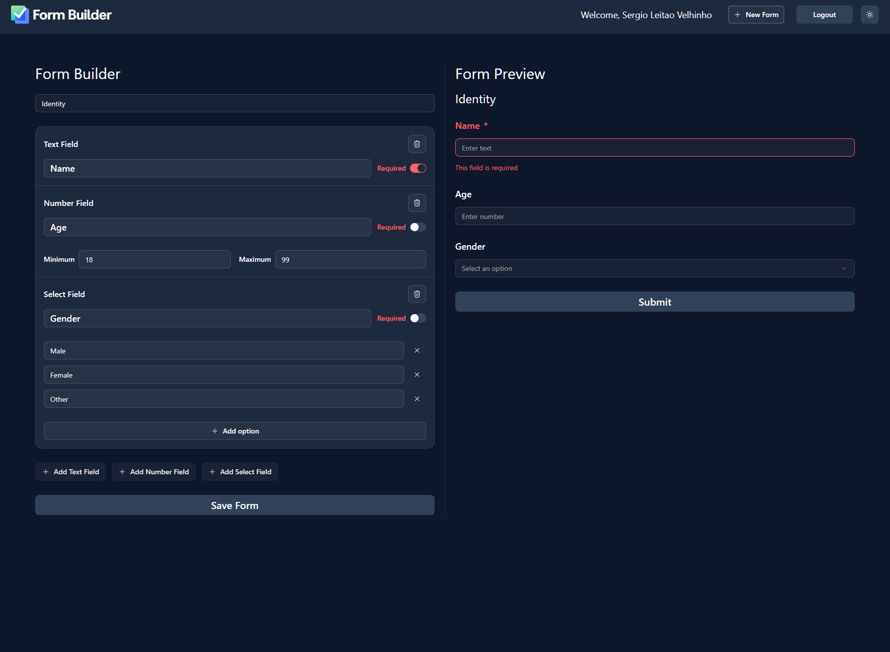
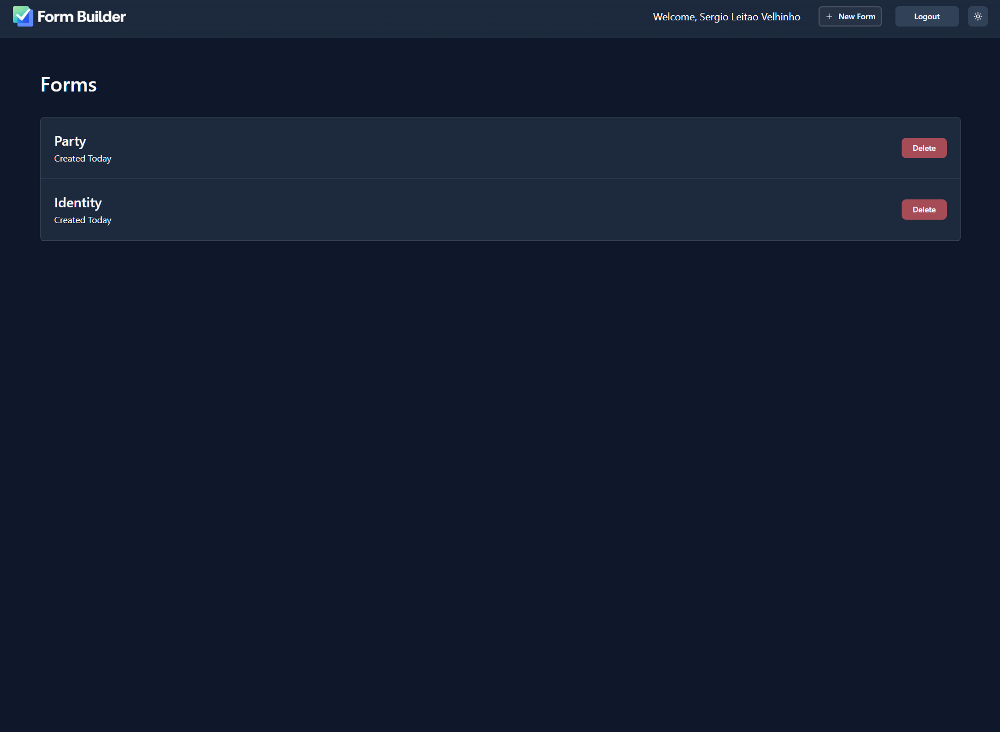
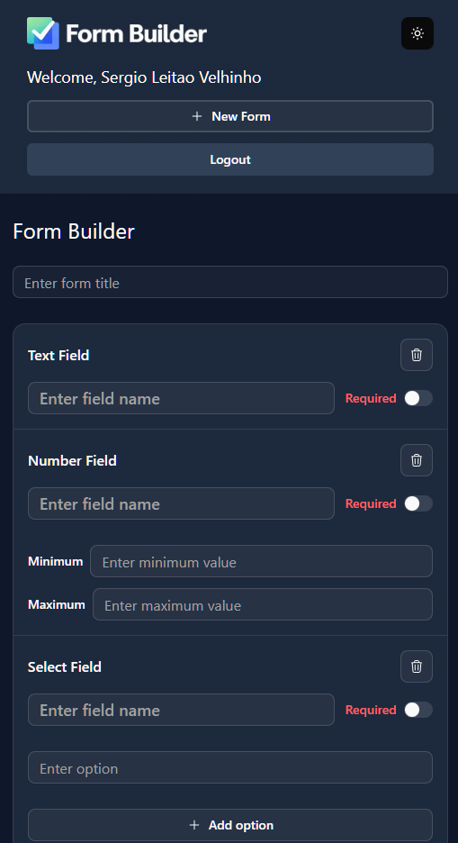

# Form Builder

A personal **Next.js form-building project** focused on dynamic UI composition, typed validation, authentication and maintainable application structure.

[Live Demo](https://form-builder-psi-wheat.vercel.app/)

> **Status:** work in progress. This is a personal technical project, not a launched production service. The live demo is hosted on Vercel with a Supabase Free Plan backend.

## Dark mode preview

<p align="center">
  
</p>

## Light mode demo

The video below shows the main flow in the light theme.

https://github.com/user-attachments/assets/1aa19272-4ef3-4b96-a910-fff5bc0bea09

## What it does

Form Builder lets authenticated users create and manage custom forms from a dashboard.

Current capabilities include:

- Email/password authentication and Google sign-in
- Account management
- Form list with pagination
- Create, edit and view form definitions
- Dynamic **text, number and select** fields
- Required-field configuration and field-specific constraints
- Drag-and-drop field reordering
- Live form preview
- Light/dark theme support

## Technical highlights

The project is mainly an exercise in building a feature-rich application while keeping state, validation and UI responsibilities separated.

- **Next.js App Router** with route groups and loading/error boundaries
- **Zustand** store dedicated to the form draft and builder interactions
- **Zod** schemas for form structure and dynamic preview validation
- **React Hook Form** for form handling
- **@hello-pangea/dnd** for drag-and-drop field ordering
- **Supabase/Postgres** for persisted application data
- **Better Auth** with email/password and Google OAuth
- **Resend** for transactional email flows
- **Vitest + Testing Library** covering builder state, schemas and form-preview behaviour

## Dark mode screenshots

### Forms dashboard

<p align="center">
  
</p>

### Responsive mobile layout

<p align="center">
  
</p>

## Stack

**Frontend**  
Next.js 16 · React 19 · TypeScript · Tailwind CSS · Radix UI

**State & validation**  
Zustand · React Hook Form · Zod

**Backend & services**  
Supabase · PostgreSQL · Better Auth · Resend

**Quality**  
Vitest · Testing Library · ESLint · Prettier

## Local setup

### Requirements

- Node.js 20+ recommended
- A Supabase/Postgres project
- Google OAuth credentials if Google sign-in is enabled
- A Resend API key for email flows

### Environment variables

Create a `.env.local` file in the project root:

```bash
# App
NEXT_PUBLIC_APP_URL=http://localhost:3000

# Supabase
NEXT_PUBLIC_SUPABASE_URL=
NEXT_SECRET_SUPABASE_DEFAULT_KEY=
NEXT_PUBLIC_SUPABASE_PUBLISHABLE_DEFAULT_KEY=

# Database / Better Auth
DATABASE_URL=

# Email
RESEND_API_KEY=

# Google OAuth
GOOGLE_CLIENT_ID=
GOOGLE_CLIENT_SECRET=
```

### Install and run

```bash
npm install
npm run dev
```

The development server runs at `http://localhost:3000`.

### Tests and lint

```bash
npm run test
npm run lint
```

### Production build

```bash
npm run build
npm run start
```
